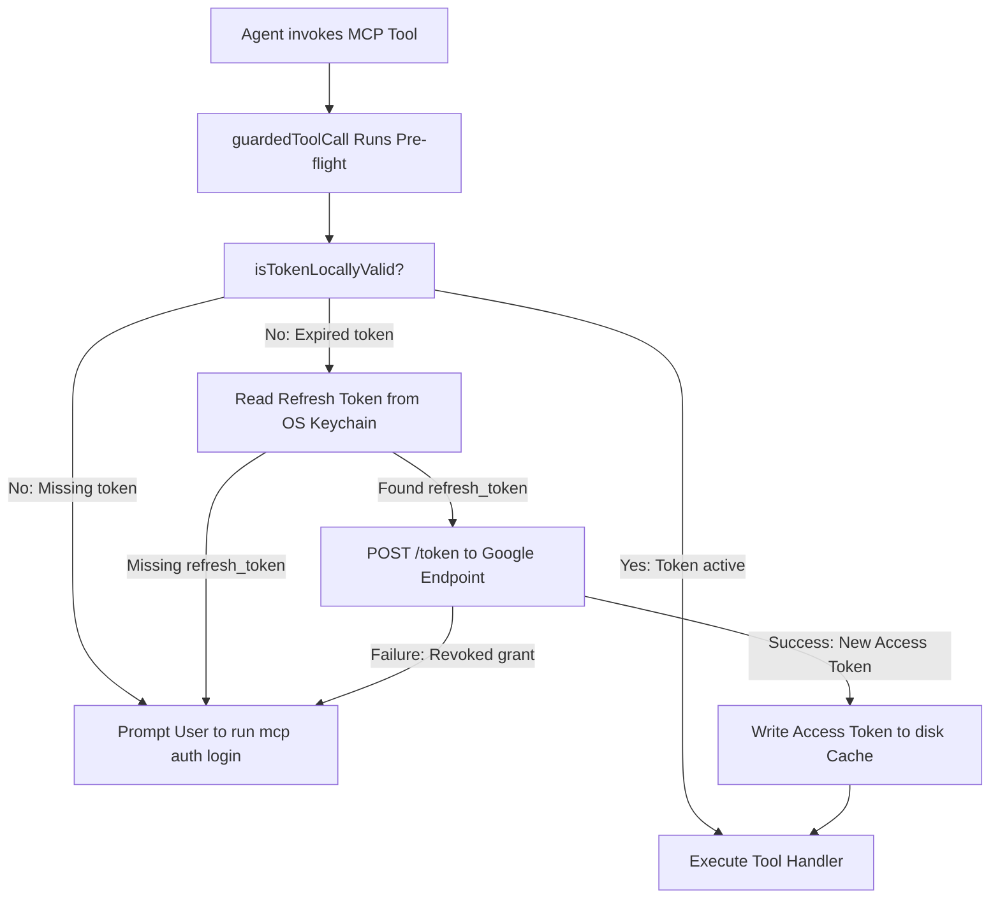

# Architectural Blueprint: Phase 2 Authentication Mechanics

This document articulates the **detailed technical mechanics** for **Phase 2 (Hosted Callback Redirect & Persistent OS Keychain)**. It explains how the authentication architecture shifts from short-lived online caching to a highly secure, persistent, and friction-free hosted model once GCP resources are ready.

---

## 1. The Architectural Shift: Online vs. Offline Access

Today, the server operates on short-lived, online-only credentials. Phase 2 introduces a permanent secure credential model:

```
                   +-----------------------------------------------+
                   |            OAUTH ACCESS-TYPE COMPARISON       |
                   +-----------------------------------------------+

     [ Online Flow (Today) ]                     [ Offline Flow (Phase 2) ]
   - access_type: 'online'                     - access_type: 'offline'
   - prompt: none                              - prompt: 'consent'
   - Token payload only contains:              - Token payload contains:
     access_token & id_token.                    access_token, id_token, AND refresh_token.
   - Expiry: exactly 60 minutes.               - Expiry: Access token lasts 60 minutes;
   - Friction: user must manually                refresh token is long-lived/permanent.
     re-consent every hour.                    - Friction: Silently renews; zero user friction.
```

### The Security Storage Invariant

Because the `refresh_token` allows permanent access to sensitive Workspace Admin scopes (Chrome policy, DLP, Admin reports), **it must never be stored in plaintext on disk.**
To resolve this, Phase 2 splits the storage engines:

1. **Access Token (Short-lived):** Cached in plaintext on disk (`~/.config/cep-mcp/tokens.json`).
2. **Refresh Token (Long-lived):** Caches inside the native **OS Keychain** (macOS Keychain, Windows Credential Vault, gnome-keyring/libsecret on Linux) using `@napi-rs/keyring`.

---

## 2. Coordinated Hosted Token Exchange Flow

When GCP resources are ready, the token exchange process changes. Rather than local loopback clients performing the token exchange directly, a hosted serverless service performs it to eliminate laptop 404 copy-paste failures.

```mermaid
sequenceDiagram
    actor User
    participant CLI as CLI / Stdio Server
    participant Laptop as Laptop Browser
    participant CloudRun as Hosted Cloud Run
    participant SM as GCP Secret Manager
    participant Google as Google Auth Server

    User->>CLI: mcp auth login
    CLI->>User: Outputs Google Consent URL
    User->>Laptop: Opens Consent URL in Browser
    Laptop->>Google: GET /o/oauth2/v2/auth
    User->>Google: Grants Consent
    Google->>Laptop: Redirects to Cloud Run Redirect URI
    Laptop->>CloudRun: GET /redirect?code=AUTH_CODE&state=CSRF_PORT
    CloudRun->>SM: Fetches Client Secret (Cached in memory)
    SM-->>CloudRun: Client Secret
    CloudRun->>Google: POST /token (Exchanges AUTH_CODE + Client Secret)
    Google-->>CloudRun: Returns Tokens (Access + Refresh JSON)

    alt Same-Machine Flow (state.manual=false)
        CloudRun-->>Laptop: HTML Auto-submitting POST Form (Tokens in Body)
        Laptop->>CLI: POST / (Delivers credentials payload)
        CLI-->>User: Sign-in Successful (Access to Cache; Refresh to Keychain)
    else Headless VM Flow (state.manual=true)
        CloudRun-->>Laptop: Renders Manual Landing Page with Copy JSON Button
        User->>Laptop: Clicks Copy JSON
        User->>CLI: Pastes credentials JSON payload
        CLI-->>User: Sign-in Successful (Access to Cache; Refresh to Keychain)
    end
```

---

## 3. The Secure POST Auto-Submit Mechanism

To prevent exposing the sensitive long-lived refresh token inside URL parameters (which leaks secrets in browser history, proxies, referer headers, and GCP log buckets), Phase 2 replaces the `302 Redirect` with a secure **HTML POST Form Auto-Submitter**.

### Cloud Run Output (POST Form Body)

When a successful exchange completes in same-machine mode, the Cloud Run service returns this HTML (status `200`) to the user's browser:

```html
<!doctype html>
<html lang="en">
  <head>
    <meta charset="utf-8" />
    <title>Authenticating local MCP server...</title>
  </head>
  <body>
    <p>Transmitting credentials securely to local MCP server...</p>
    <form id="authForm" method="POST" action="http://127.0.0.1:PORT_FROM_STATE/">
      <input type="hidden" name="credentials" value="ESC_JSON_CREDENTIALS_PAYLOAD" />
      <input type="hidden" name="state" value="CSRF_TOKEN" />
    </form>
    <script>
      document.getElementById('authForm').submit()
    </script>
  </body>
</html>
```

### Upgraded Local Loopback Server (`loopback_server.js`)

The local loopback server is upgraded to support both `GET` and `POST` requests:

1. If `req.method === 'POST'`, the server buffers the form-encoded body chunks.
2. Parses the urlencoded fields to extract the hidden `credentials` input.
3. Resolves the token-exchange promise with the parsed credentials payload directly.

---

## 4. Background Token Refresh Mechanism

Once the refresh token is securely persisted inside the OS Keychain, the requirement for hourly manual user re-authorization is eliminated. The server automatically coordinates access token refreshing in the background:



### The Silent Renewal Logic

When the tool wrapper pre-flight detects an expired access token:

1. It calls the Keychain Store helper to fetch the stored credential:
   ```javascript
   const refreshToken = await getRefreshToken(accountName)
   ```
2. Constructs a fresh `OAuth2Client` using the bundled Client ID and secret, and sets the credentials:
   ```javascript
   const oauth2 = new OAuth2Client({ clientId, clientSecret })
   oauth2.setCredentials({ refresh_token: refreshToken })
   ```
3. Silently requests a new access token:
   ```javascript
   const { credentials } = await oauth2.refreshAccessToken()
   ```
4. Caches the new short-lived access token and expiry timestamp on disk (`TokenCache`), completely bypassing any browser popups.
